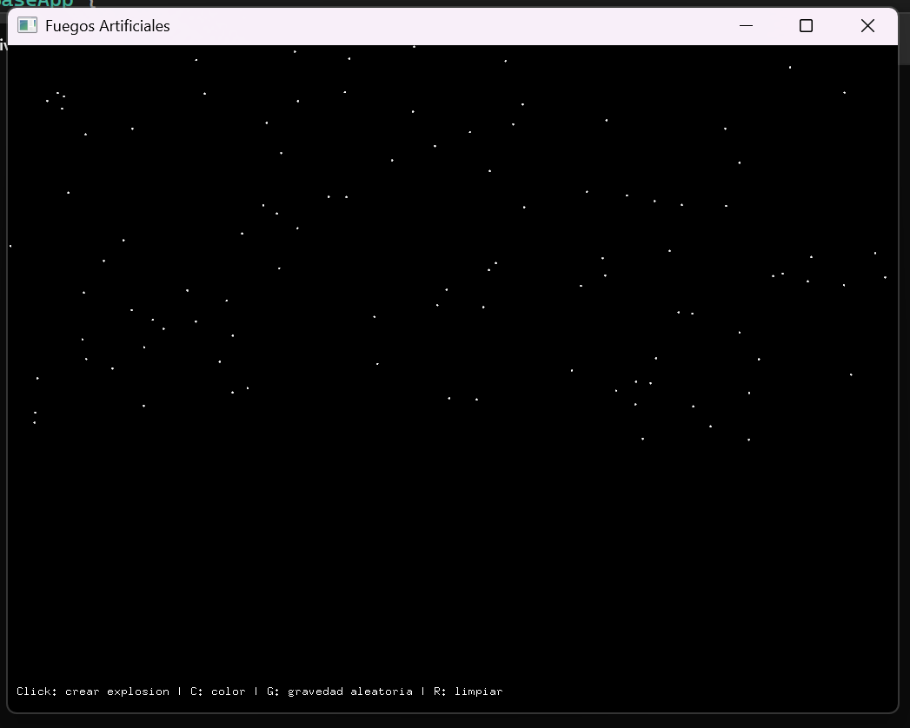
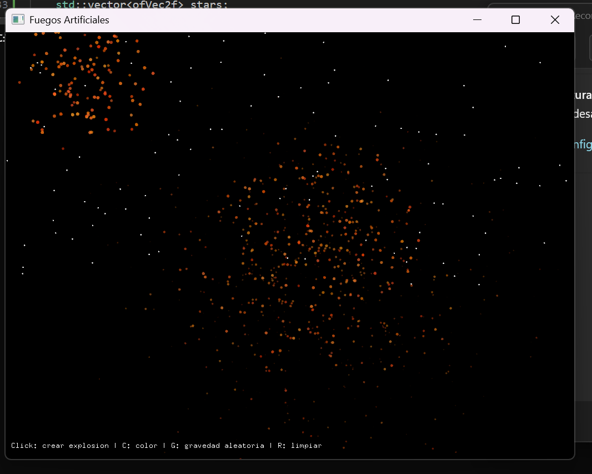
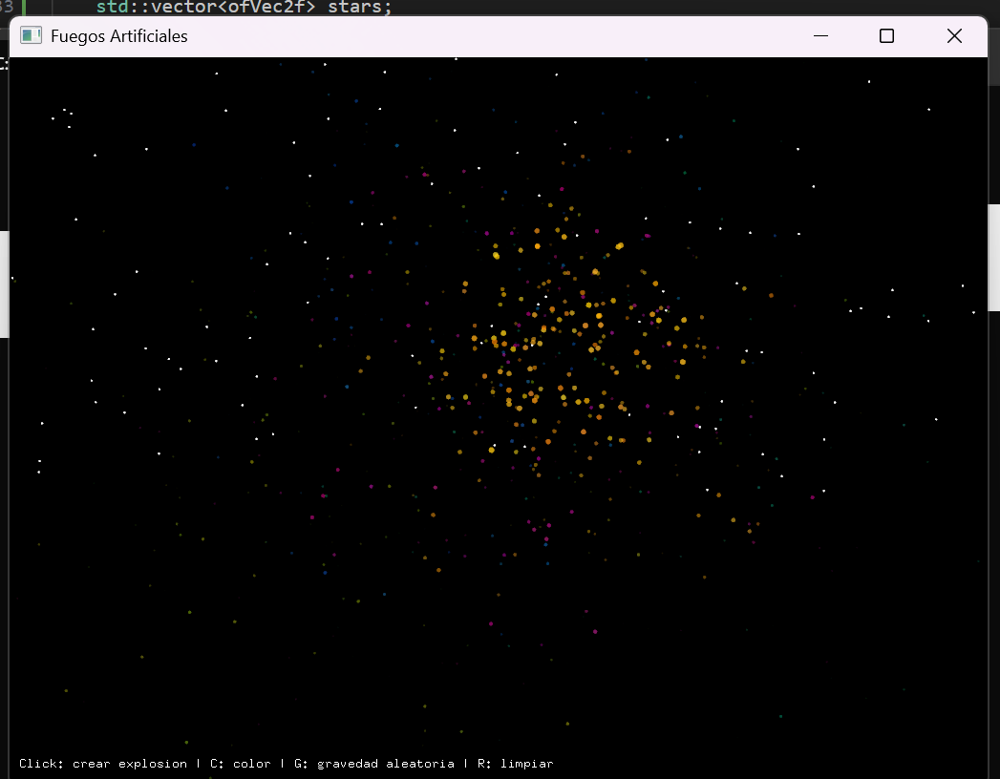
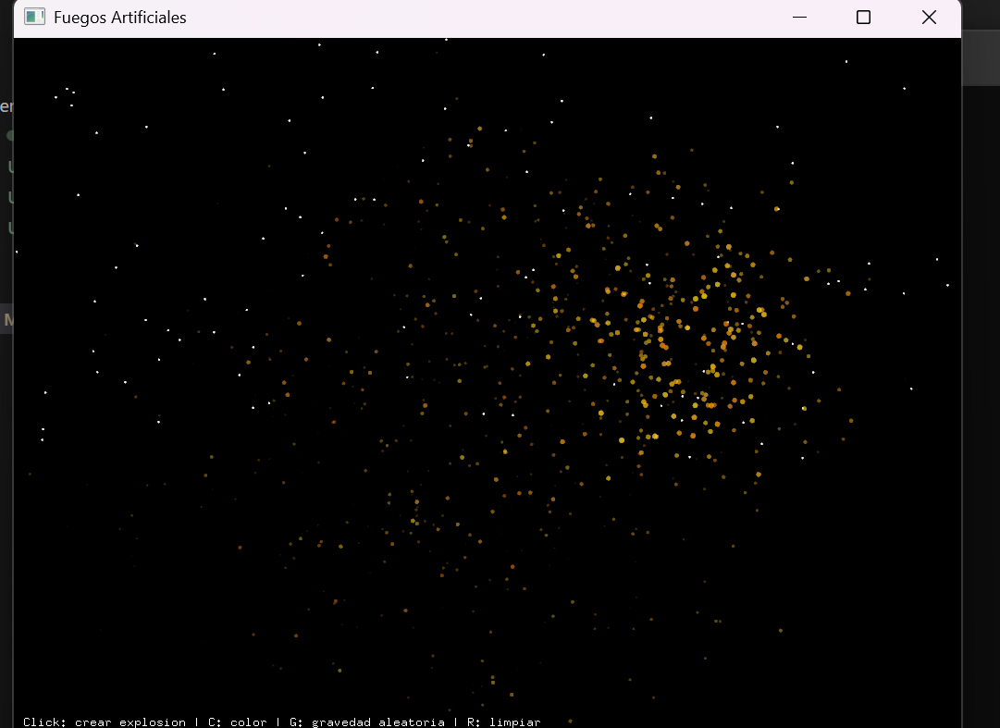
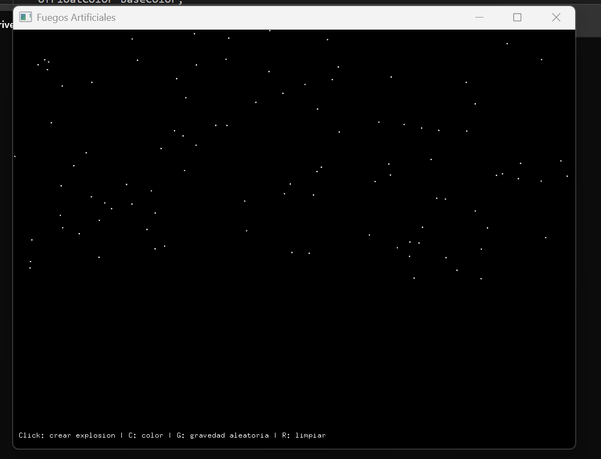

**Preguntas para guiar el proceso**
1. **Exploración creativa:** ¿Qué tipo de efecto visual quieres lograr? ¿Cómo pueden ayudarte las diferentes estructuras de datos a lograr ese efecto?  

**Fuegos artificiales:** arreglo de partículas y pila para manejar explosiones que aparecen y desaparecen.   

El efecto visual que quiero lograr es un show de fuegos artificiales que explotan en el cielo y se dispersan en muchas direcciones con colores llamativos. Para organizar esto, **usaría un arreglo de partículas**, ya que cada explosión genera varias al mismo tiempo. También usaría una **pila de explosiones**, donde voy guardando las que aparecen y eliminando las que ya se apagaron. Así puedo controlar de forma ordenada cómo nacen y desaparecen los fuegos artificiales, aunque en la pantalla parezca un espectáculo caótico.

**Nota 1:** Se usa pila porque la última explosión creada será la primera en revisarse y eliminarse cuando termine.  

**Nota 2:** los puntitos estarian todos juntos en un arreglo.

2. **Gestión de memoria:** ¿Qué consideraciones debes tener en cuenta al gestionar dinámicamente la memoria de los objetos? ¿Cómo asegurar que no haya fugas de memoria?   
Hay que tener cuidado de liberar esa memoria cuando ya no se usa. Si no se hace, la memoria se va llenando poco a poco y el programa se vuelve lento o incluso se puede cerrar solo. Para evitar fugas de memoria, cada vez que una explosión termina, borro todas sus partículas usando delate y libero el espacio que ocupaban. También debo revisar que los punteros no queden apuntando a nada (reviso si termina en nullptr), porque eso puede causar errores. Así me aseguro de que el programa use solo la memoria necesaria y funcione de manera fluida.

3. **Interacción y dinamismo:** ¿Cómo puedes hacer que la interacción del usuario influya en múltiples estructuras de datos simultáneamente para crear un efecto visual coherente y dinámico?   
La interacción del usuario hace que los fuegos artificiales cambien en tiempo real. Por ejemplo, al hacer clic se agrega una nueva explosión a la pila y tambien podria hacer que cuando use una tecla cambie el color de los fuegos artificiales.

4. **Optimización:** ¿Qué técnicas puedes implementar para optimizar la gestión de memoria y el rendimiento de tu aplicación mientras mantienes una experiencia visual rica y fluida?  
Para que el programa sea rápido y no consuma mucha memoria, libero las partículas cuando ya no sirven, pongo un límite a las explosiones activas y evito crear más de las necesarias. Así la obra se ve fluida y ordenada.  

**Nota:** Las partículas se crean con new[] cuando aparece la explosión, y se liberan con delete[] cuando desaparece.

### Código  
```cpp
#include "ofApp.h"
#include "ofMain.h"

int main() {
	ofSetupOpenGL(1024, 768, OF_WINDOW);
	ofRunApp(new ofApp());
}
```
```cpp
#include "ofApp.h"

Explosion::Explosion(ofVec2f origin_, int n, const ofFloatColor & baseColor,
	float speedMin, float speedMax) {
	origin = origin_;
	count = n;
	finished = false;
	particles = new Particle[count];

	for (int i = 0; i < count; ++i) {
		particles[i].pos = origin;
		float ang = ofRandom(0, TWO_PI);
		float mag = ofRandom(speedMin, speedMax);
		particles[i].vel.set(cos(ang) * mag, sin(ang) * mag);
		particles[i].life = ofRandom(1.0f, 2.5f);
		particles[i].age = 0;

		float h = baseColor.getHue();
		float s = baseColor.getSaturation();
		float b = baseColor.getBrightness();
		ofFloatColor c;
		c.setHsb(ofClamp(h + ofRandom(-0.03, 0.03), 0, 1),
			ofClamp(s + ofRandom(-0.1, 0.1), 0, 1),
			ofClamp(b + ofRandom(-0.1, 0.1), 0, 1));
		c.a = 1.0f;
		particles[i].color = c;
	}
}

void Explosion::update(float dt, const ofVec2f & gravity) {
	finished = true;
	for (int i = 0; i < count; ++i) {
		if (!particles[i].isDead()) {
			particles[i].update(dt, gravity);
			finished = false;
		}
	}
}

void Explosion::draw() {
	ofFill();
	for (int i = 0; i < count; ++i) {
		if (!particles[i].isDead()) {
			float r = ofMap(particles[i].color.a, 0, 1, 0.5f, 3.5f);
			ofSetColor(particles[i].color);
			ofDrawCircle(particles[i].pos, r);
		}
	}
}

bool Explosion::isFinished() const { return finished; }

Explosion::~Explosion() {
	delete[] particles;
	particles = nullptr;
}

void ofApp::setup() {
	ofSetWindowTitle("Fuegos Artificiales");
	ofBackground(0);
	ofSetFrameRate(60);

	gravity.set(0, 60);
	randomGravity = false;

	maxExplosions = 12;
	particlesPerExplosion = 120;
	baseColor.setHsb(ofRandom(0, 1), 0.9f, 1.0f);

	int nStars = 100;
	stars.resize(nStars);
	for (int i = 0; i < nStars; ++i) {
		stars[i].set(ofRandomWidth(), ofRandomHeight() * 0.6f);
	}
}

void ofApp::spawnExplosion(int x, int y) {
	if ((int)stackExplosions.size() >= maxExplosions) {
		Explosion * oldest = stackExplosions.front();
		delete oldest;
		stackExplosions.erase(stackExplosions.begin());
	}
	Explosion * e = new Explosion(ofVec2f(x, y), particlesPerExplosion,
		baseColor, 40, 250);
	stackExplosions.push_back(e);
}

void ofApp::update() {
	float dt = ofGetLastFrameTime();
	ofVec2f g = gravity;
	if (randomGravity) {
		g.y = gravity.y + ofRandom(-30, 30);
		g.x = ofRandom(-10, 10);
	}

	for (int i = (int)stackExplosions.size() - 1; i >= 0; --i) {
		stackExplosions[i]->update(dt, g);
	}
	cleanupFinishedExplosions();
}

void ofApp::cleanupFinishedExplosions() {
	for (int i = (int)stackExplosions.size() - 1; i >= 0; --i) {
		if (stackExplosions[i]->isFinished()) {
			delete stackExplosions[i];
			stackExplosions.erase(stackExplosions.begin() + i);
		}
	}
}

void ofApp::draw() {
	ofSetColor(255);
	for (auto & s : stars)
		ofDrawCircle(s.x, s.y, 1.1f);

	for (auto * e : stackExplosions)
		e->draw();

	ofSetColor(255);
	string info = "Click: crear explosion | C: color | G: gravedad aleatoria | R: limpiar";
	ofDrawBitmapStringHighlight(info, 10, ofGetHeight() - 20);
}

void ofApp::mousePressed(int x, int y, int button) {
	spawnExplosion(x, y);
}

void ofApp::keyPressed(int key) {
	if (key == 'c' || key == 'C') {
		baseColor.setHsb(ofRandom(0, 1), 0.9f, 1.0f);
	} else if (key == 'g' || key == 'G') {
		randomGravity = !randomGravity;
	} else if (key == 'r' || key == 'R') {
		for (auto * e : stackExplosions)
			delete e;
		stackExplosions.clear();
	}
}

void ofApp::exit() {
	for (auto * e : stackExplosions)
		delete e;
	stackExplosions.clear();
}
```
```cpp
#pragma once
#include "ofMain.h"

struct Particle {
	ofVec2f pos;
	ofVec2f vel;
	ofFloatColor color;
	float life;
	float age;

	Particle()
		: pos(0, 0)
		, vel(0, 0)
		, color(1, 1, 1, 1)
		, life(1.0f)
		, age(0) { }

	void update(float dt, const ofVec2f & gravity) {
		vel += gravity * dt;
		pos += vel * dt;
		age += dt;
		float t = ofClamp(age / life, 0.0f, 1.0f);
		color.a = 1.0f - t;
	}

	bool isDead() const { return age >= life; }
};

class Explosion {
public:
	Particle * particles;
	int count;
	ofVec2f origin;
	bool finished;

	Explosion(ofVec2f origin_, int n, const ofFloatColor & baseColor, float speedMin, float speedMax);
	void update(float dt, const ofVec2f & gravity);
	void draw();
	bool isFinished() const;
	~Explosion();
};

class ofApp : public ofBaseApp {
public:
	void setup();
	void update();
	void draw();
	void keyPressed(int key);
	void mousePressed(int x, int y, int button);
	void exit();

private:
	std::vector<Explosion *> stackExplosions;
	std::vector<ofVec2f> stars;

	ofVec2f gravity;
	int maxExplosions;
	int particlesPerExplosion;
	ofFloatColor baseColor;
	bool randomGravity;

	void spawnExplosion(int x, int y);
	void cleanupFinishedExplosions();
};
```  
**RAE 1 – Construcción de la aplicación**
Hice un programa de fuegos artificiales en el cual usé un arreglo de partículas para cada explosión y una pila para guardar las explosiones que van saliendo y desapareciendo. El usuario puede dar clic para crear nuevas explosiones, usar la tecla C para cambiar colores, la G para activar o quitar gravedad y la R para borrar todo. También cuidé que la memoria se libere cuando las explosiones terminan, para que el programa no se ponga lento. Con esto cumplí lo que pedía el reto: que sea interactivo, que use estructuras de datos y que funcione bien.  

**Aquí se evidencia el cielo para los fuegos artificiales**  

  
**Aquí se muestran los fuegos artificiales despues de hacer click**  

  
**Aquí se evidencia cuando cambian de color los fuegos artificiales**   

  
**Aquí se evidencia como se borran los fuegos artificiales**    
Antes:  

  
Despues: 

  

**RAE 2 – Pruebas del programa**

Probé cada parte por separado: revisé que las partículas se muevan bien, que las explosiones se eliminen cuando acaban y que los colores cambien al presionar la tecla. Después probé todo junto, creando muchas explosiones, activando y quitando la gravedad y borrando la pantalla para ver que no fallara. También verifiqué que la memoria no se quede ocupada cuando las explosiones se borran. Con estas pruebas me aseguré de que el programa completo funciona sin errores.  

**Algunas pruebas**
* Probé que al dar un clic saliera una sola explosión en el lugar correcto y que las partículas tuvieran colores y tamaños diferentes.    
* Revisé que cada partícula se fuera apagando hasta desaparecer, para ver que su tiempo de vida sí funcionara.    
* Verifiqué que las teclas C y G cambiaran los colores y la gravedad en todas las partículas que ya estaban en pantalla.    
* Hice clic en varios lugares para ver que siempre salieran las explosiones y que el movimiento fuera fluido.  
* Comprobé que el efecto completo se viera bien, como un espectáculo de fuegos artificiales.  

[Video funcionamiento programa](https://youtu.be/p_z_aiNJ2_Q)  


