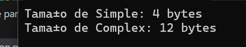
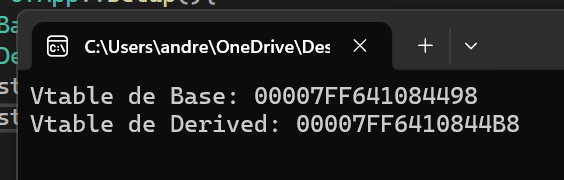
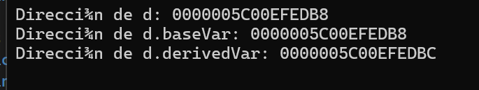
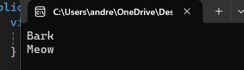

## Sesión 1: la naturaleza de los objetos en C++  
## Introducción a los Objetos

Concepto: un objeto es una instancia de una clase que combina datos (atributos) y comportamiento (métodos).

Considera el siguiente caso de estudio:  
```cpp
class Particle {
public:
    float x, y;
    void move(float dx, float dy) {
        x += dx;
        y += dy;
    }
};
```
**¿Qué representa la clase Particle?**
representa la posicion y el movimiento de un objeto que combina los atributos y los métodos.  

**¿Cómo interactúan sus atributos y métodos?**   
El método de move ayuda a cambiar los atributos de la posición sumandoles 1.  

**Prompt para ChatGPT: explícame en detalle qué es un objeto en C++ y cómo se relaciona con una clase. Usa el ejemplo de una clase Particle con atributos x y y y un método move.**  
* Clase = definición/plantilla. Objeto = instancia concreta que ocupa memoria.  
* Un objeto contiene los datos (miembros) en memoria; los métodos no se duplican por objeto.  
* this es el puntero implícito que permite al método actuar sobre el objeto.  
* El layout suele poner los miembros en orden declarado (con padding); el compilador puede añadir un vptr si hay virtuales.   
* Tiempo de vida y forma de asignación (stack vs heap vs estático) determinan cuándo y cómo se crean/ destruyen los objetos.   
* Ten cuidado con inicialización (usa constructores o {}), copia/ movimiento y slicing cuando haya herencia.    

## Explorando la memoria
**Objetivo: entender cómo se almacenan los objetos en memoria.**    
Considera los siguientes pasos:  
Crear instancias:  
```
Particle p1;
Particle p2;
```

**Explorar la memoria usando punteros:**  
```
std::cout << "Dirección de p1: " << &p1 << std::endl;
std::cout << "Dirección de p2: " << &p2 << std::endl;
```
**Determinar el tamaño del objeto:**  
```
std::cout << "Tamaño de Particle: " << sizeof(Particle) << " bytes" << std::endl;
```

**Imprimir direcciones de atributos:**  
```
std::cout << "Dirección de p1.x: " << &(p1.x) << std::endl;
std::cout << "Dirección de p1.y: " << &(p1.y) << std::endl;
```  
## Reflexión Guiada:  
* **¿Los atributos están almacenados de forma contigua?**  
Sí, x y y quedan uno al lado del otro en memoria, solo puede haber un pequeño espacio de alineación.  

* **¿Qué indica el tamaño del objeto sobre su estructura interna?**  
Que solo guarda sus datos (x y y), los métodos no ocupan espacio en cada objeto.  

**Prompt para ChatGPT: ¿Cómo se almacenan los objetos en memoria en C++? Si tengo dos instancias de Particle, ¿Cómo se relacionan sus direcciones de memoria? ¿Los atributos están contiguos?**  
Se guardan como bloques de bytes que contienen solo sus datos.
Cada objeto (p1, p2) ocupa su propio bloque; sus direcciones son distintas y no se mezclan.
Dentro de cada objeto, los atributos (x, y) están uno junto al otro en memoria, con posible pequeño padding.  

## Análisis de diferencias  
**Objetivo: comparar cómo diferentes clases afectan el uso de memoria.**  

Considera los siguientes pasos:  
**Crear clases con diferentes atributos y métodos:**  
```cpp
class Simple {
public:
    int a;
};

class Complex {
public:
    int a, b, c;
    void method1() {}
    void method2() {}
};
```

**Compara los tamaños:**  
```cpp
std::cout << "Tamaño de Simple: " << sizeof(Simple) << " bytes" << std::endl;
std::cout << "Tamaño de Complex: " << sizeof(Complex) << " bytes" << std::endl;
```
**Agregar datos estáticos y dinámicos:**  
```cpp
class StaticData {
public:
    static int s;
    int a;
};

int StaticData::s = 0;

class DynamicData {
public:
    int* ptr;
    DynamicData() {
        ptr = new int[10];
    }
    ~DynamicData() {
        delete[] ptr;
    }
};
``` 
  

**¿Cómo afectan los datos estáticos al tamaño de la instancia?**  
No lo cambian, la variable static vive en una zona global y es única para toda la clase, así que cada objeto solo cuenta el tamaño de sus miembros no estáticos.  

**¿Qué diferencias hay entre datos estáticos y dinámicos en términos de memoria?**
* **Estáticos:** un solo espacio compartido por todos los objetos; existe todo el programa.  
* **Dinámicos:** se piden con new y viven en el heap; cada objeto puede reservar su propio bloque y hay que liberarlo en el destructor.  

**Prompt para ChatGPT: explícame cómo el uso de variables estáticas y dinámicas en una clase afecta el tamaño de sus instancias. ¿Las variables estáticas ocupan espacio en cada objeto?**  
* Las variables estáticas no aumentan el tamaño de cada objeto, porque se guardan una sola vez en una zona global y todos los objetos comparten esa misma dirección.  
* Las variables dinámicas sí influyen: el puntero miembro (por ejemplo int* ptr) cuenta en el tamaño del objeto, y además cada objeto puede pedir memoria extra en el heap con new, que no se refleja en sizeof pero sí ocupa espacio fuera del objeto.  

## Reflexión

**Documenta en tu bitácora de aprendizaje:**  

**¿Qué es un objeto desde la perspectiva de la memoria?**  
Un objeto es un bloque de memoria que guarda solo los valores de sus atributos (y un posible puntero oculto si hay herencia o virtuales).  

**¿Cómo influyen los atributos y métodos en el tamaño y estructura del objeto?**  
Los atributos suman espacio al tamaño del objeto. Los métodos no ocupan espacio en cada uno. Las variables static no cuentan y los punteros solo pesan lo que mide el puntero, no lo que apuntan.  

**Conclusión: resumir los hallazgos y cómo esto impacta el diseño de clases.**  
El tamaño de una clase depende de sus miembros de datos, alineación y punteros internos, no de sus funciones. Al diseñar clases conviene elegir tipos y estructuras pensando en el espacio que ocuparán y en cómo administrar la memoria si se usan recursos dinámicos.  

## Sesión 2: ubicación en memoria de datos y métodos    
## Análisis de la estructura de una clase    
* Datos: los atributos se almacenan en el stack o heap, según cómo se instancien.  
* Métodos: el código de los métodos reside en la sección de código (texto) del programa.  
* Vtables: estructuras usadas para implementar métodos virtuales.   

**Prompt para ChatGPT: ¿Dónde se almacenan los datos y métodos de una clase en C++ en la memoria? Explica el concepto de vtable y cómo se relaciona con los métodos virtua**   
En C++ cada parte de una clase se guarda en zonas distintas:  
* Atributos normales: en la memoria del objeto (stack si es local o heap si usas new).   
* static: una sola copia en el segmento global/estático, compartida por todos los objetos.  
* Código de métodos: en el segmento de código; no aumenta el sizeof del objeto.  
* Memoria dinámica: en el heap, el objeto solo guarda un puntero.  

**vtable**    
Si la clase tiene métodos virtual, el compilador crea una vtable (tabla de punteros a funciones) en memoria de solo lectura.
Cada objeto polimórfico guarda un vptr (puntero a esa tabla).
Cuando llamas a un método virtual, se usa el vptr para encontrar en tiempo de ejecución la implementación correcta.  

## Exploración de métodos virtuales

Objetivo: comprender el impacto de los métodos virtuales en la memoria y el rendimiento.

Considera los siguientes pasos:

**Crea una jerarquía de clases con métodos virtuales:**
```cpp
cpp
class Base {
public:
    virtual void display() {
        std::cout << "Base display" << std::endl;
    }
};

class Derived : public Base {
public:
    void display() override {
        std::cout << "Derived display" << std::endl;
    }
};
```
**Analiza la vtables. ¿En qué parte de la memoria se encuentran las vtable de cada objeto?**   
* La vtable está en la memoria global de solo lectura.   
* Cada objeto solo guarda un vptr que apunta a esa vtable.   
```cpp
Base b;
Derived d;
std::cout << "Vtable de Base: " << *(void**)&b << std::endl;
std::cout << "Vtable de Derived: " << *(void**)&d << std::endl;
```
**Todo junto**

   

**Usar un depurador: observar cómo se resuelven las llamadas a métodos virtuales en tiempo de ejecución. Puedes usar para ello varias herramientas del depurador. En el menú Debug de Visual Studio, selecciona Windows y luego Memory. Allí podrás explorar la memoria. Si das click derecho sobre una función del código puedes ver el programa en ensamblador con Go to Dissasembly.**  

**¿Cómo afecta la presencia de métodos virtuales al tamaño del objeto?**  
Hace que cada objeto tenga un puntero extra oculto que apunta a la tabla de funciones virtuales, así que el objeto ocupa un poco más de memoria que uno sin métodos virtuales.  

**¿Qué papel juegan las vtables en el polimorfismo?**  
Las vtables guardan las direcciones de las funciones virtuales y permiten que, al llamar un método, se ejecute la versión del objeto real, haciendo posible el polimorfismo.  

**Prompt para ChatGPT:¿Cómo se implementan los métodos virtuales en C++? Explica el concepto de vtable y cómo se utiliza para resolver llamadas a métodos virtuales.**  
En C++ los métodos virtuales se logran con dos piezas clave:

vtable (virtual table): Para cada clase con métodos virtuales el compilador crea una tabla única que guarda las direcciones de las funciones virtuales de esa clase.  

* vptr (virtual pointer): Cada objeto de esa clase lleva oculto un puntero que apunta a la vtable de su tipo real.
* Cuando llamas a un método virtual a través de un puntero o referencia, el programa:  
* Lee el vptr del objeto.  
* Entra a la vtable indicada.  
* Salta a la dirección de la función que allí está.  

Así, aunque uses un puntero de la clase base, se ejecuta la versión del método que corresponde al tipo verdadero del objeto, permitiendo el polimorfismo dinámico.

## Uso de punteros y referencias  
Objetivo: explorar cómo los punteros y referencias afectan la gestión de la memoria y la llamada a métodos.  
Considera estos pasos:  

**1. Implementar una clase con punteros a funciones:**

```cpp
class FunctionPointerExample {
public:
    void (*funcPtr)();
    static void staticFunction() {
        std::cout << "Static function called" << std::endl;
    }
    void assignFunction() {
        funcPtr = staticFunction;
    }
};
```

**1. Analizar el impacto en memoria:**
* Observar si el tamaño de la instancia cambia al usar punteros a funciones.   
Sí, el objeto es un poquito más grande porque guarda el puntero a la función. En un sistema de 64 bits ese puntero ocupa 8 bytes, así que la instancia aumenta justo ese espacio.  

* Verificar cómo se almacenan estos punteros.  
El puntero a la función se guarda como un dato normal dentro del objeto, en la misma parte de memoria donde están sus otros atributos.  

## Reflexión Guiada:
**¿Cuál es la relación entre los punteros a métodos y la vtable?**    
Los punteros a métodos no usan la vtable. Son direcciones que tú guardas en un atributo, mientras que la vtable es creada por el compilador para manejar métodos virtuales automáticamente.  

**¿Cómo afectan estos mecanismos al rendimiento del programa?**  
Hacen que la llamada a la función tenga un pequeño paso extra porque el programa primero mira la dirección guardada en el puntero, pero esa diferencia es mínima y casi no se nota en el rendimiento.

**Prompt para ChatGPT: ¿Qué diferencia hay entre punteros a funciones y punteros a métodos miembro en C++? ¿Cómo afectan al tamaño de los objetos y al rendimiento?**   
**Diferencia:**  
* Un puntero a función guarda solo la dirección de una función libre o estática.  
* Un puntero a método miembro también necesita saber a qué objeto pertenece, así que internamente puede tener más información que un simple puntero.   

**Tamaño del objeto:**  
* Si guardas un puntero a función, el objeto aumenta solo lo que mide un puntero normal.  
* Un puntero a método miembro puede ocupar un poco más de memoria, pero la diferencia es pequeña.  

**Rendimiento:**  
Llamar a través de cualquiera de los dos implica un salto indirecto en vez de ir directo a la función, así que es apenas un poquito más lento, casi imperceptible en programas comunes.   

## Reflexión individual:  
**¿Dónde residen los datos y métodos de una clase en la memoria?**   
Los datos de cada objeto se guardan en la memoria donde se crea (pila, heap o global), mientras que el código de los métodos está una sola vez en la sección de código y lo comparten todos los objetos. Si hay métodos virtuales, cada objeto añade un puntero a la vtable.  

**¿Cómo interactúan las diferentes partes en tiempo de ejecución?**   
Cuando el programa corre, cada objeto usa su espacio de memoria para guardar sus datos, mientras que las funciones de la clase se ejecutan desde el código que todos comparten. Si la clase tiene métodos virtuales, el objeto consulta su puntero a la vtable para encontrar y ejecutar la versión correcta de la función en ese momento.  

**Conclusión: cómo esta comprensión afecta el diseño de sistemas.**     
Saber dónde se guardan los datos y el código de una clase me ayuda a programar mejor, porque entiendo cuánta memoria usa cada objeto y qué partes se comparten. Así puedo decidir si crear objetos en la pila o en el heap, y cuándo vale la pena usar métodos virtuales para tener polimorfismo aunque ocupen un poco más de espacio.  

## Sesión 3: implementación Interna de Encapsulamiento, Herencia y Polimorfismo   
Profundizando en el encapsulamiento
Modificadores de acceso: private, protected, public. Control de acceso: implementado por el compilador, no por restricciones en tiempo de ejecución.
Crear una clase con diferentes niveles de acceso:  
````cpp
class AccessControl {
private:
    int privateVar;
protected:
    int protectedVar;
public:
    int publicVar;
    AccessControl() : privateVar(1), protectedVar(2), publicVar(3) {}
};
​````
Intentar acceder a los miembros desde una función externa:  
````cpp
int main() {
    AccessControl ac;
    ac.publicVar = 10; // Válido
    // ac.protectedVar = 20; // Error de compilación
    // ac.privateVar = 30; // Error de compilación
    return 0;
}
````
**Prompt para ChatGPT: ¿Cómo implementa el compilador el encapsulamiento en C++? Si los miembros privados aún ocupan espacio en el objeto, ¿Qué impide que se acceda a ellos desde fuera de la clase?**  
En C++ el encapsulamiento es una regla del compilador, no un candado físico en la memoria.  
Cuando declaras un miembro private o protected, el compilador:  
 
* Registra el nivel de acceso de cada variable y función al analizar la clase.   
* Revisa cada uso de esos nombres en el resto del código.   
* Si encuentra un acceso que no cumple las reglas, genera un error de compilación y no produce el ejecutable.   

Por eso los datos privados siguen ocupando espacio dentro de cada objeto (igual que los públicos), pero ningún código válido puede obtener su dirección directamente, porque el compilador nunca genera las instrucciones para hacerlo.   
En tiempo de ejecución no hay comprobación especial: simplemente el binario final no contiene accesos ilegales.  

**Ejemplo de como protege lo que está privado**   

  

## Hagamos un poco de hackers y rompamos el encapsulamiento  

## Ahora reflexiona:

**¿Qué es el encapsulamiento y cuál es su propósito en la programación orientada a objetos?**   
Es la forma de esconder los datos de una clase para que solo se accedan de manera controlada y el programa sea más seguro y ordenado.

**¿Por qué es importante proteger los datos de una clase y restringir el acceso desde fuera de la misma?**  
Para evitar que otros cambien valores internos y así prevenir errores y fallos en el programa.

**¿Qué significa reinterpret_cast y cómo afecta la seguridad del programa?**  
Es un truco para tratar un dato como si fuera de otro tipo, pero puede romper las reglas de acceso y causar errores o problemas de seguridad.

**¿Por qué crees que se pudo acceder a los miembros privados de MyClass en este experimento, a pesar de que el compilador normalmente lo impediría?**  
Porque el truco salta las revisiones del compilador y accede directo a la memoria.

**¿Cuáles podrían ser las consecuencias de utilizar técnicas como las mostradas en este experimento en un programa real?**  
Puede provocar fallos graves, pérdida de datos y abrir huecos de seguridad.

**¿Qué implicaciones tiene este experimento sobre la confianza en las barreras de encapsulamiento que proporciona C++?**   
Que es una regla del compilador para mantener orden, pero no una barrera imposible de romper.

## Herencia y la Relación en Memoria  
Considera los siguientes pasos:  
Crear clases con herencia:  
````cpp
class Base {
public:
    int baseVar;
};
class Derived : public Base {
public:
    int derivedVar;
};
​````

Analizar las direcciones de memoria:
````cpp
Derived d;
std::cout << "Dirección de d: " << &d << std::endl;
std::cout << "Dirección de d.baseVar: " << &(d.baseVar) << std::endl;
std::cout << "Dirección de d.derivedVar: " << &(d.derivedVar) << std::endl;
````
  

**¿Cómo se organizan los atributos en memoria?**  
Primero se guardan los de la clase base y después, en orden, los de la clase derivada. Así un objeto derivado empieza igual que uno de la base.

**¿Qué sucede si agregamos más niveles de herencia?**   
Cada nueva clase agrega sus propios atributos al final, de modo que la memoria queda en cadena: primero la base más antigua y luego cada derivada en el orden de la herencia.  

**Prompt para ChatGPT: explícame cómo se organiza en memoria un objeto de una clase derivada en C++. ¿Cómo se almacenan los atributos de la clase base y de la derivada?**  
En C++ un objeto de una clase derivada empieza en memoria con la parte de la clase base.  
Primero se colocan, en el mismo orden en que fueron declarados, todos los atributos de la base, respetando la alineación del compilador.  
Después, justo a continuación, se guardan los atributos propios de la clase derivada en el orden en que aparecen en su definición.  

Así, la dirección del objeto (&obj) coincide con la de su primer atributo de la base, lo que permite que un puntero o referencia a la clase base pueda usar ese objeto sin mover nada en memoria.   
Si hay varios niveles de herencia, cada nivel añade sus miembros al final, uno tras otro, formando una sola estructura continua.  

## Polimorfismo y Vtables en detalle  
Considera los siguientes pasos:  
Crear una jerarquía polimórfica:  
````cpp
class Animal {
public:
    virtual void makeSound() {
        std::cout << "Some generic sound" << std::endl;
    }
};
class Dog : public Animal {
public:
    void makeSound() override {
        std::cout << "Bark" << std::endl;
    }
};
class Cat : public Animal {
public:
    void makeSound() override {
        std::cout << "Meow" << std::endl;
    }
};
​````
Usar punteros de la clase base:  
````cpp
Animal* animals[] = { new Dog(), new Cat() };
for (Animal* animal : animals) {
    animal->makeSound();
}
````  
**Prueba**  


**1. Analizar con un depurador: observa cómo se resuelven las llamadas a makeSound() en tiempo de ejecución.**  

* **¿Cómo utiliza el programa las vtables para el polimorfismo?**  
Cada objeto guarda un puntero a su vtable, que tiene las direcciones de los métodos virtuales. Al llamar makeSound(), el programa mira la vtable y ejecuta la versión correcta según el tipo real del objeto.

* **¿Cuál es el impacto en el rendimiento?**  
El impacto es muy pequeño: cada llamada a un método virtual hace una búsqueda extra en la vtable, que es solo un acceso a memoria y un salto indirecto. Esto es un poco más lento que llamar a una función normal, pero en la mayoría de programas la diferencia es casi imposible de notar.  

* **Prompt para ChatGPT: ¿Cómo funciona el polimorfismo en C++ a nivel interno? Explica cómo se utilizan las vtables para resolver métodos virtuales en una jerarquía de herencia.**  
En C++ el polimorfismo se logra con métodos virtuales y una estructura llamada vtable.  
Cuando una clase declara un método virtual, el compilador agrega en cada objeto un puntero oculto que apunta a la vtable de su tipo real.  

La vtable es una tabla con las direcciones en memoria de las funciones virtuales de esa clase.  
Si una clase derivada redefine un método, su vtable guarda la dirección de esa nueva versión.  

En tiempo de ejecución, cuando llamas a un método virtual a través de un puntero o referencia a la clase base, el programa:  

* Lee el puntero oculto del objeto.  
* Accede a la vtable de la clase real del objeto.  
* Salta a la dirección de la función correspondiente en esa tabla.  

Así, un Animal* puede ejecutar el makeSound() propio de Dog o Cat sin que el compilador sepa el tipo exacto en tiempo de compilación.

## Reflexión Individual:  
**¿Cómo se implementan internamente el encapsulamiento, la herencia y el polimorfismo?**  
El compilador protege los datos privados revisando el código, aunque sigan en memoria. En herencia, el objeto hijo guarda primero los datos de la base y luego los suyos. Con polimorfismo, cada objeto tiene un puntero a una vtable y el programa usa esa tabla para llamar al método correcto según el tipo real.

**Análisis: ventajas y desventajas en términos de eficiencia y complejidad.**  
Estas técnicas hacen el código más ordenado y fácil de mantener. El costo es mínimo: la herencia solo suma algo de memoria y el polimorfismo un pequeño tiempo al buscar en la vtable. La desventaja es que el diseño puede volverse más complicado con muchas clases.  